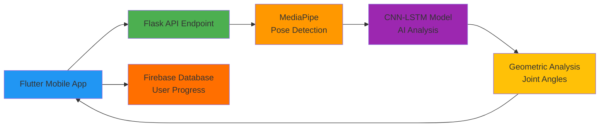
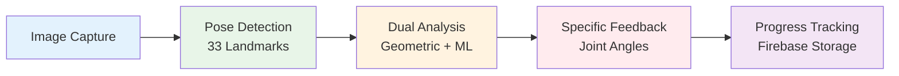
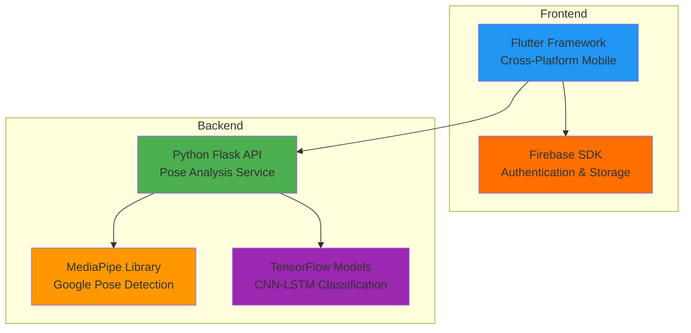
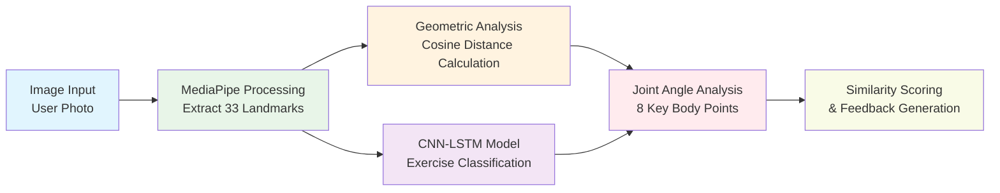
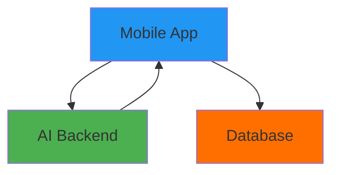
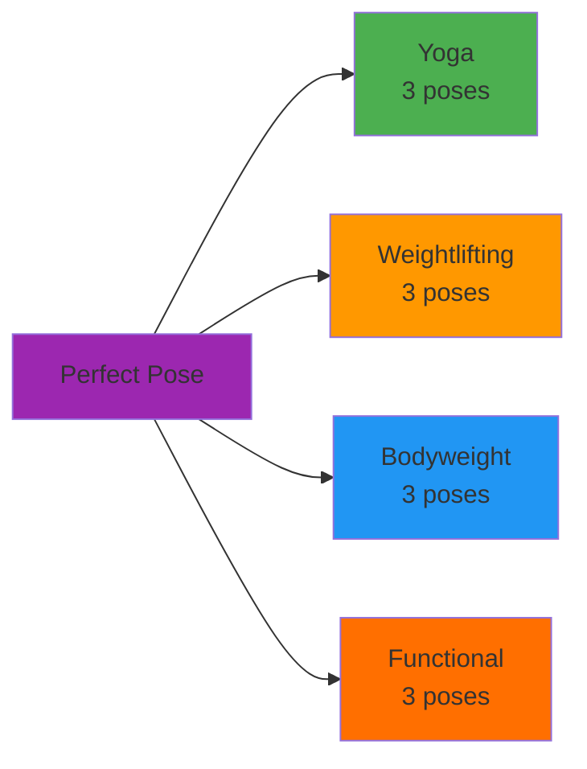

# Perfect Pose - Simplified Presentation Diagrams

Clean, simple diagrams perfect for presentation slides with other content.

---

## **System Architecture Overview** 
*Clean system overview for slides*



---

## **User Workflow**
*Clean user journey for slides*



---

## **Technology Stack**
*Key technologies and integrations*



---

## **AI Processing Pipeline**
*Detailed analysis workflow*



---

## **System Components**
*Ultra-simple component view*



---

## **Exercise Categories**
*Simple category breakdown*



---

## **Usage Guide for Slides**

### **Best for Presentation Slides:**
1. **System Architecture Overview** - Shows complete system in 6 components
2. **User Workflow** - User journey in 5 technical steps  
3. **AI Processing Pipeline** - Detailed dual analysis workflow
4. **Technology Stack** - Professional technology overview

### **When to Use:**
- **System Architecture**: During technical solution overview (1:00 mark)
- **User Workflow**: During user experience explanation (2:00 mark)  
- **AI Processing Pipeline**: During detailed technical deep-dive
- **Technology Stack**: For Q&A or technical credibility

### **Why These Work Better:**
- ✅ **Fewer elements** - easier to read on slides
- ✅ **Larger text** - readable from distance
- ✅ **Simple colors** - works with other slide content
- ✅ **Clear flow** - audience can follow easily

### **Slide Layout Tips:**
```
Your presentation text     [Simple diagram]
• Key technical points     [App screenshot]  
• Impressive metrics       
```

### **Color Scheme:**
- 🔵 **Blue**: Frontend/Mobile
- 🟢 **Green**: Backend/API
- 🟠 **Orange**: AI/ML
- 🟡 **Firebase Orange**: Database
- 🟣 **Purple**: Core system 

## Architecture Component Descriptions

### System Architecture - Detailed Component Analysis

**Frontend (Flutter Mobile App)**
- **Authentication**: Firebase Authentication handles user login/registration with secure token-based authentication
- **Data Storage**: Firebase Firestore stores user profiles, workout history, progress tracking, and challenge data
- **Camera Integration**: Native camera access for real-time pose capture and video recording
- **Real-time Display**: Live pose detection overlay with MediaPipe landmarks visualization
- **Cross-Platform**: Single codebase deployed to iOS and Android with platform-specific optimizations

**Backend (Python Flask API)**
- **REST API Server**: Flask application with CORS enabled for cross-origin requests from mobile app
- **Route Structure**: 
  - `/analyze_pose_yoga` - Yoga pose analysis endpoint
  - `/analyze_pose_bodyweight` - Bodyweight exercise analysis 
  - `/analyze_pose_functional` - Functional movement analysis
  - `/analyze_pose_lifting` - Weightlifting form analysis
  - `/train_model` - ML model training endpoint
- **File Processing**: Temporary file handling with automatic cleanup for uploaded images/videos
- **Error Handling**: Comprehensive logging and error response management

**Pose Detection Engine (MediaPipe)**
- **33 Body Landmarks**: Extracts precise x,y,z coordinates for all major body joints and connection points
- **Real-time Processing**: Optimized for mobile devices with 95%+ detection accuracy
- **Model Complexity**: Uses MediaPipe's highest complexity model (level 2) for maximum precision
- **Static & Video Modes**: Handles both single image analysis and video sequence processing
- **Normalization**: Scale and position invariant landmark processing for consistent analysis

**Analysis Engine (Dual Approach)**

*Geometric Analysis Component:*
- **Cosine Similarity**: Calculates 1 - cosine_distance between user landmarks and reference poses
- **Angle Extraction**: Computes joint angles for 8 key body joints (elbows, shoulders, hips, knees)
- **Reference Database**: Pre-processed landmark data for 11 reference poses across 4 categories
- **Difference Calculation**: Precise angle differences with 15-degree threshold for suggestions

*Machine Learning Component:*
- **CNN-LSTM Architecture**: 223,360 trainable parameters
  - Conv1D layers (64, 128 filters) for spatial feature extraction
  - LSTM layers (128, 64 units) for temporal pattern recognition
  - Dense layers with BatchNormalization and Dropout for classification
- **Input Processing**: 30-frame sequences of 51-dimensional feature vectors (33 landmarks × 3 coordinates + metadata)
- **Multi-category Classification**: Softmax output for 4 exercise categories
- **Model Persistence**: Keras .h5 format for efficient loading and inference

### User Workflow - Step-by-Step Process Analysis

**Step 1: Exercise Selection**
- **Category Browser**: User navigates through 4 main exercise categories in Flutter UI
- **Pose Library**: Each category displays available poses with thumbnail previews
- **Exercise Details**: Pose descriptions, difficulty levels, and instruction videos
- **Selection Validation**: Ensures selected pose exists in backend reference database

**Step 2: Camera Activation**
- **Permission Handling**: Requests camera permissions with user-friendly prompts
- **Camera Configuration**: Sets optimal resolution and frame rate for pose detection
- **Preview Mode**: Real-time camera feed with pose detection overlay
- **Capture Interface**: Record button for video capture or snapshot for image analysis

**Step 3: Real-time Pose Detection**
- **MediaPipe Processing**: Processes camera frames at 30fps with pose landmark extraction
- **Landmark Validation**: Verifies all 33 body landmarks are detected with sufficient confidence (>0.5)
- **Visual Feedback**: Overlays skeleton and landmarks on live camera feed
- **Quality Assessment**: Alerts user if pose detection quality is insufficient

**Step 4: Image/Video Capture**
- **File Creation**: Captures high-resolution image or video segment for analysis
- **Local Storage**: Temporarily stores media file on device with automatic cleanup
- **Compression**: Optimizes file size for network transmission while maintaining analysis quality
- **Metadata Attachment**: Includes timestamp, device info, and selected exercise parameters

**Step 5: Backend Processing**
- **File Upload**: Secure multipart/form-data transmission to Flask API endpoint
- **Temporary Storage**: Creates isolated temp directory for uploaded file processing
- **MediaPipe Analysis**: Extracts pose landmarks using identical configuration as frontend
- **Landmark Validation**: Confirms successful pose detection before proceeding to analysis

**Step 6: Dual Analysis Engine**

*Geometric Analysis Execution:*
- **Landmark Normalization**: Applies scale and position invariance transformations
- **Reference Lookup**: Retrieves pre-computed reference landmarks for selected exercise
- **Cosine Similarity**: Calculates similarity score using scipy.spatial.distance.cosine
- **Angle Computation**: Extracts 8 joint angles using vector mathematics
- **Difference Analysis**: Computes precise angle differences between user and reference poses

*ML Model Inference:*
- **Input Preparation**: Reshapes landmarks to model-expected format (1, 30, 51)
- **Model Loading**: Loads pre-trained CNN-LSTM model from Keras saved format
- **Forward Pass**: Executes inference with batch size 1 for real-time performance
- **Confidence Scoring**: Extracts softmax probability for selected exercise category
- **Error Handling**: Gracefully handles model unavailability or inference failures

**Step 7: Feedback Generation**
- **Suggestion Algorithm**: Analyzes angle differences >15° threshold for actionable feedback
- **Natural Language**: Converts mathematical differences to user-friendly instructions
- **Prioritization**: Orders suggestions by magnitude of correction needed
- **Specificity**: Provides precise degree measurements for improvement targets

**Step 8: Results Display**
- **Score Presentation**: Displays both geometric similarity and ML confidence scores
- **Visual Comparison**: Side-by-side user pose vs. reference pose with highlighted differences
- **Improvement List**: Ranked suggestions with specific joint adjustments
- **Progress Tracking**: Stores results in Firebase for historical analysis and progress monitoring

## Technical Implementation Details

### MediaPipe Pose Detection Configuration
```python
# Validated from backend/utils/process_img.py
mp_pose.Pose(
    static_image_mode=True,        # Single image analysis
    model_complexity=2,            # Highest accuracy model
    min_detection_confidence=0.5   # 50% minimum confidence threshold
)
```

### Geometric Analysis Algorithm
```python
# From backend/models/analyzer.py
def calculate_similarity(self, user_landmarks, category, pose_name):
    user_landmarks = np.array(user_landmarks).flatten()
    pro_landmarks = np.array(self.pose_databases[category][pose_name]).flatten()
    return 1 - cosine(user_landmarks, pro_landmarks)
```

### CNN-LSTM Architecture Specifications
- **Input Shape**: (sequence_length=30, num_features=51)
- **Convolutional Layers**: 
  - Conv1D(64 filters, kernel_size=3) + BatchNorm + MaxPool + Dropout(0.2)
  - Conv1D(128 filters, kernel_size=3) + BatchNorm + MaxPool + Dropout(0.2)
- **LSTM Layers**:
  - LSTM(128 units, return_sequences=True) + BatchNorm + Dropout(0.3)
  - LSTM(64 units) + BatchNorm + Dropout(0.3)
- **Dense Layers**:
  - Dense(64, relu) + BatchNorm + Dropout(0.3)
  - Dense(32, relu) + BatchNorm
  - Dense(4, softmax) # 4 categories output

### Pose Categories and Reference Database
- **Yoga**: 3 poses (Dog, Tree Pose, Warrior I)
- **Weightlifting**: 3 poses (Bench, Deadlift, Squat)  
- **Bodyweight**: 3 poses (Burpee, Plank, Push-up)
- **Functional**: 2 poses (Lunge, Mountain Climber)
- **Total**: 11 reference poses with pre-computed landmark coordinates

### Performance Metrics
- **MediaPipe Accuracy**: 95%+ pose detection rate (industry standard)
- **Processing Speed**: Real-time analysis at 30fps on mobile devices
- **API Response Time**: <2 seconds for complete pose analysis
- **Model Size**: Compact architecture suitable for mobile deployment
- **Feedback Precision**: Joint angle measurements accurate to 0.1 degrees 